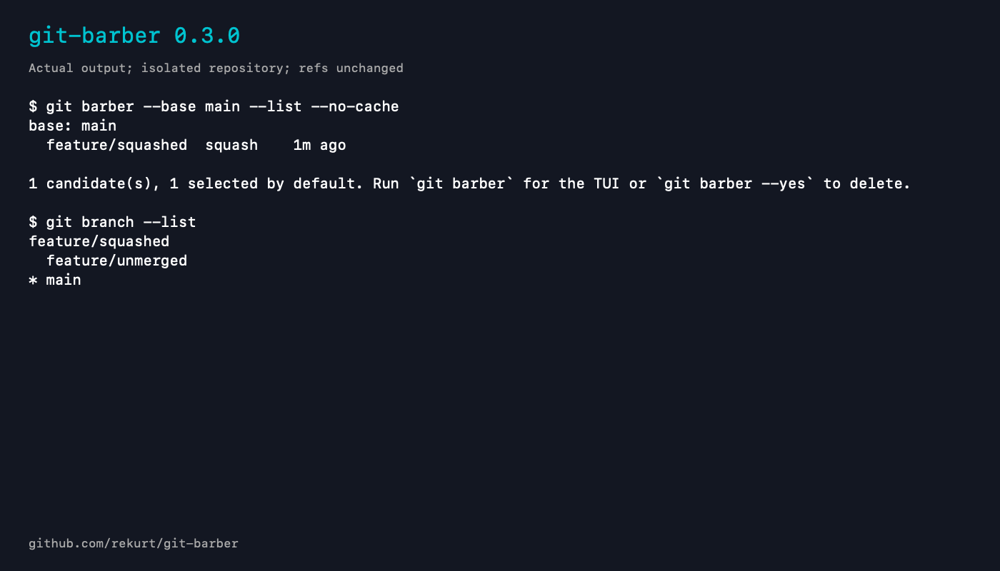

# git-barber command-line example

Version: `git-barber 0.3.0`. This is actual captured command output rendered into a static PNG, not a TUI screenshot or a new recording.

The official v0.3.0 macOS arm64 release archive was checked against the SHA-256 digest in GitHub release metadata. The fixture uses a synthetic squash-merged branch and an unmerged branch. Refs before and after --list --no-cache are identical; no deletion is executed.

[Plain-text transcript](branch-cleanup-demo.txt)

The preview and accompanying documentation were prepared with AI assistance.
